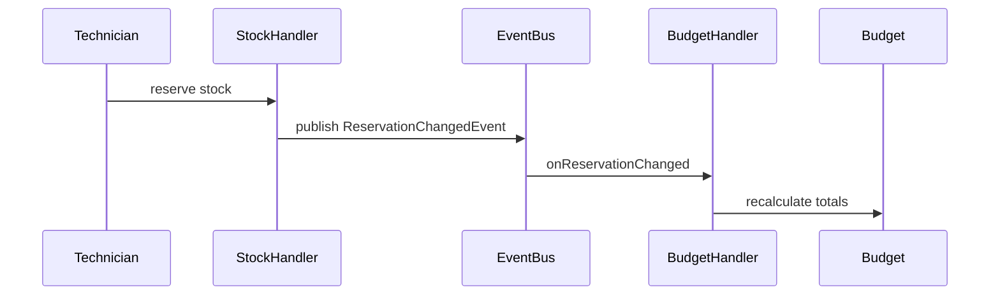

# Padrões de Projeto

## Vertical Slice Architecture (VSA)

Toda funcionalidade fica isolada em sua **própria pasta vertical**, incluindo controller, handlers, DTOs e repositório. Nenhuma dependência cruzada entre features (exceto via shared domain).

```
Tradicional (Layered):          VSA:
controllers/                    features/
  ClientController               client/
  VehicleController                ClientController
services/                          create/  update/  findById/
  ClientService                    shared/domain/ repository/
repositories/                   vehicle/
  ClientRepository                 VehicleController
                                   ...
```

> [!tip] Benefício
> Encontrar e modificar uma feature não exige conhecer o sistema todo — tudo está no mesmo lugar.

## Handler Pattern (Use Case por Classe)

Cada **caso de uso** é uma classe isolada com um único método público. O Controller apenas delega.

```java
// Controller — só delega
@PostMapping
public ResponseEntity<CreateClientResponse> create(@RequestBody CreateClientRequest req) {
    return ResponseEntity.ok(createClientHandler.handle(req));
}

// Handler — lógica de negócio isolada
@Component
public class CreateClientHandler {
    public CreateClientResponse handle(CreateClientRequest request) { ... }
}
```

## Repository Pattern

Repositórios são **interfaces abstratas** no domínio, implementadas por adapters JPA. O domínio não conhece Hibernate ou Spring Data.

```java
// Porta (domínio)
interface ClientRepository {
    Optional<Client> findById(UUID id);
    void save(Client client);
}

// Adapter (infra)
@Repository
class ClientJpaRepository implements ClientRepository { ... }
```

## Domain-Driven Design (DDD)

### Aggregate Root
`Client` é um Aggregate Root com invariantes: nome obrigatório, CPF validado.

```java
public class Client {
    // Factory Methods — separa criação de reconstituição
    public static Client create(String name, Cpf cpf, ...) { ... }
    public static Client reconstitute(UUID id, String name, ...) { ... }
}
```

### Value Object
`Cpf` encapsula validação do CPF (aceita formatado ou não):

```java
public record Cpf(String value) {
    public Cpf {
        // valida formato e dígitos verificadores
    }
}
```

### Domain Events
`ReservationChangedEvent` é publicado pelo stock ao confirmar/liberar reserva. O `BudgetRecalculateHandler` ouve e recalcula o orçamento automaticamente.

```java
// Publicador
applicationEventPublisher.publishEvent(new ReservationChangedEvent(serviceOrderId));

// Ouvinte
@EventListener
public void onReservationChanged(ReservationChangedEvent event) {
    budgetRecalculateHandler.handle(event.serviceOrderId());
}
```

## Soft Delete

Clientes e veículos nunca são deletados fisicamente. Uma flag `active` no banco indica se o registro está ativo.

```sql
-- Não usa DELETE
UPDATE clients SET active = false WHERE id = ?;

-- Queries sempre filtram por active = true
SELECT * FROM clients WHERE active = true;
```

## MapStruct — Mapeamento DTO ↔ Entity

MapStruct gera código de mapeamento em compile-time (zero reflection em runtime):

```java
@Mapper(componentModel = "spring")
public interface ClientMapper {
    ClientEntity toEntity(Client domain);
    Client toDomain(ClientEntity entity);
}
```

## Event-Driven Budget

O orçamento **não é calculado manualmente** — ele reage a eventos de reserva de estoque:



## Links Relacionados
- [[Visao Geral]]
- [[Estrutura de Pastas]]
- [[Dominio DDD]]
- [[Orcamento]]
