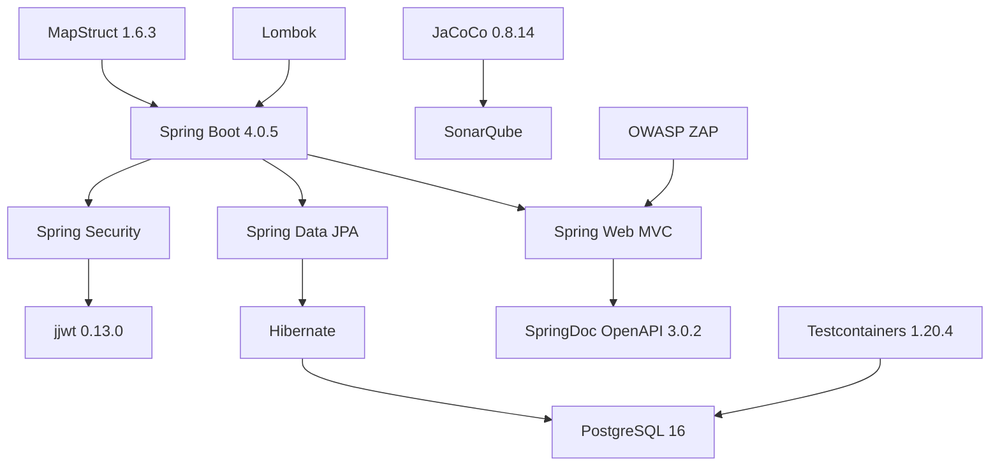

# Tecnologias e Stack

## Stack Principal

| Componente | Tecnologia | Versão | Finalidade |
|---|---|---|---|
| Linguagem | Java | 21 LTS | Linguagem principal |
| Framework | Spring Boot | 4.0.5 | Web framework e injeção de dependência |
| Segurança | Spring Security | (Boot managed) | Autenticação e autorização |
| ORM | Hibernate / JPA | (Boot managed) | Persistência de dados |
| Banco de Dados | PostgreSQL | 16 | Banco relacional |
| Queries | Spring Data JPA | (Boot managed) | Derived queries + JPQL |
| Documentação REST | SpringDoc OpenAPI | 3.0.2 | Swagger UI + OpenAPI spec |
| Mapeamento | MapStruct | 1.6.3 | DTO ↔ Entity mapping |
| Utilitários | Lombok | (Boot managed) | Redução de boilerplate |
| JWT | jjwt | 0.13.0 | Geração e validação de tokens |
| Build | Maven | 3.9.9 | Gerenciamento de dependências e build |
| Container | Docker | Latest | Containerização |
| Orquestração | Docker Compose | Latest | Multi-container |

## Stack de Testes

| Componente | Tecnologia | Versão | Finalidade |
|---|---|---|---|
| Framework de Teste | JUnit 5 | (Boot managed) | Testes unitários |
| Mocks | Mockito | (Boot managed) | Mocking em testes |
| Containers de Teste | Testcontainers | 1.20.4 | PostgreSQL real em testes de integração |
| Cobertura | JaCoCo | 0.8.14 | Relatórios de cobertura de código |

## Stack de Qualidade e Segurança

| Componente | Tecnologia | Finalidade |
|---|---|---|
| Análise Estática | SonarQube Community | Qualidade, bugs, code smells |
| Cobertura → Sonar | JaCoCo XML Report | Feed de cobertura para SonarQube |
| Scan de Segurança | OWASP ZAP | DAST — testa API em execução |

## Por Que PostgreSQL?

> [!info] Justificativa da escolha
> - **JOINs:** Relacionamentos complexos entre OS, serviços, estoque e clientes
> - **Integridade Referencial:** Foreign keys previnem registros órfãos
> - **Transações ACID:** Crítico para reservas atômicas de estoque
> - **Schema Estruturado:** Entidades fixas bem definidas pelo domínio
> - **Queries Complexas:** Agregações para relatórios de monitoramento

## Diagrama de Dependências

## Links Relacionados
- [[Visao Geral]]
- [[JWT]]
- [[SonarQube]]
- [[OWASP ZAP]]
