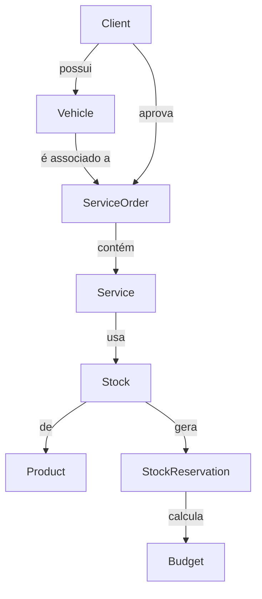

# Visão Geral do Sistema

## Propósito

Sistema de gestão digital para **oficina mecânica**, substituindo planilhas e registros em papel. Gerencia o ciclo completo de uma Ordem de Serviço (OS) desde o recebimento do veículo até a entrega ao cliente.

## Tipo de Projeto

| Atributo | Valor |
|---|---|
| Tipo | REST API — Backend Monolítico |
| Arquitetura | Vertical Slice Architecture (VSA) |
| Linguagem | Java 21 LTS |
| Framework | Spring Boot 4.0.5 |
| Banco de Dados | PostgreSQL 16 |
| Autenticação | JWT (HS256) |
| Documentação | Swagger / OpenAPI 3 |

## Arquitetura: Vertical Slice

Cada **feature** é isolada em sua própria pasta com todos os seus handlers, DTOs e lógica de negócio. Não há dependências cruzadas entre features (exceto shared domain/repository).

```
features/
├── user/         [auth]
├── client/       [clientes]
├── vehicle/      [veículos]
├── product/      [peças e suprimentos]
├── stock/        [estoque e reservas]
├── serviceorder/ [ordens de serviço]
├── service/      [serviços dentro da OS]
├── budget/       [orçamento]
└── monitoring/   [analytics]
```

> [!info] Por que VSA?
> Alta coesão e baixo acoplamento. Cada caso de uso é autocontido: Controller → Handler → Repository. Facilita manutenção e entendimento isolado de cada funcionalidade.

## Fluxo Principal


## Relacionamentos Entre Features



## Links Relacionados
- [[Estrutura de Pastas]]
- [[Tecnologias]]
- [[Padroes de Projeto]]
- [[Ciclo de Vida da OS]]
