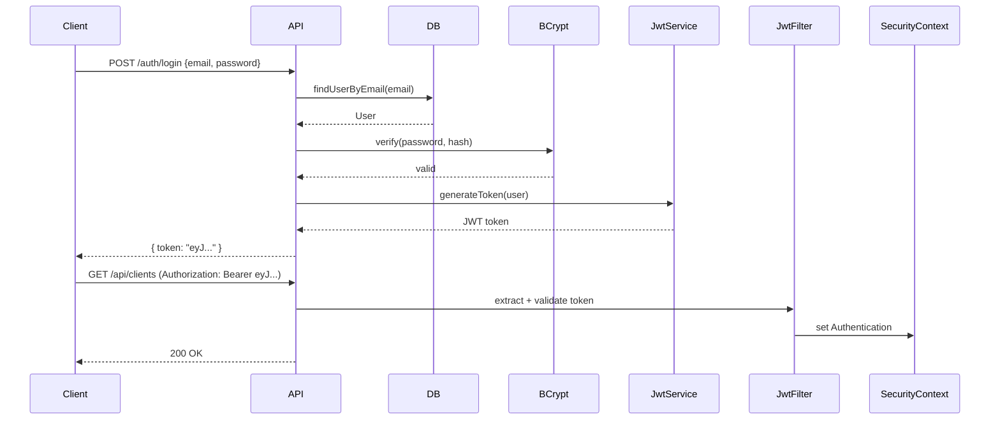

# Autorização e Roles

## Roles Disponíveis

| Role | Descrição |
|---|---|
| `ROLE_ADMIN` | Acesso total ao sistema |
| `ROLE_TECHNICIAN` | Acesso técnico: diagnóstico, serviços, estoque |
| `ROLE_USER` | Portal do cliente: ver e aprovar suas próprias OS |

## Mapa de Permissões por Endpoint

### Endpoints Públicos (sem token)
```
POST /auth/login
POST /signup
GET  /swagger-ui.html
GET  /swagger-ui/**
GET  /v3/api-docs/**
```

### Portal do Cliente (ROLE_USER, ROLE_ADMIN, ROLE_TECHNICIAN)
```
GET   /api/clients/my-orders
GET   /api/clients/my-orders/{orderId}
PATCH /api/clients/my-orders/{orderId}/approve
```

> [!info] Isolamento de Dados do Cliente
> O endpoint `my-orders` retorna **apenas as OS do cliente autenticado**. O `userId` é extraído do JWT — não pode ser falsificado via parâmetro.

### Endpoints Protegidos (ROLE_ADMIN, ROLE_TECHNICIAN)
```
Todos os demais endpoints /api/**
/order/**
/services/**
/monitoring/**
```

## Configuração no Spring Security

```java
http
  .authorizeHttpRequests(auth -> auth
    .requestMatchers("/auth/**", "/swagger-ui/**", "/v3/api-docs/**")
      .permitAll()
    .requestMatchers("/api/clients/my-orders/**")
      .hasAnyRole("USER", "ADMIN", "TECHNICIAN")
    .anyRequest()
      .hasAnyRole("ADMIN", "TECHNICIAN")
  )
  .sessionManagement(s -> s.sessionCreationPolicy(STATELESS))
  .csrf(csrf -> csrf.disable());
```

> [!warning] CSRF Desabilitado
> CSRF está desabilitado porque a API é stateless (JWT). APIs REST que não usam cookies para autenticação não são vulneráveis a CSRF.

## Fluxo de Autenticação



## Usuário Super Admin (Pré-carregado)

| Campo | Valor |
|---|---|
| Email | `superadmin@system.com` |
| Senha | `coxinha123` |
| Roles | ROLE_ADMIN + ROLE_USER + ROLE_TECHNICIAN |

> [!danger] Ambiente Produção
> Altere as credenciais do super admin antes de qualquer deploy em produção!

## Links Relacionados
- [[JWT]]
- [[Spring Security Config]]
- [[API - Autenticacao]]
- [[Credenciais e Seeds]]
