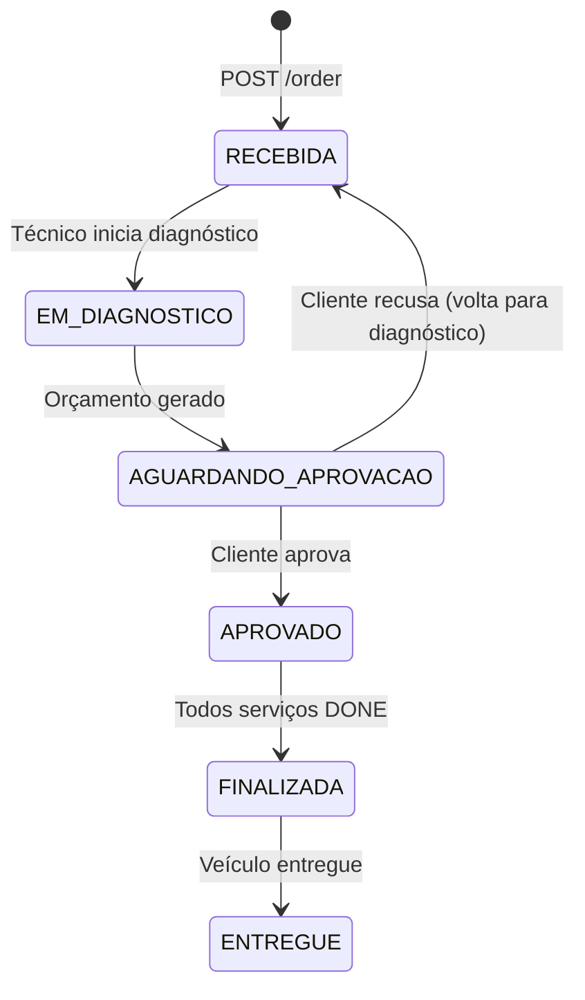
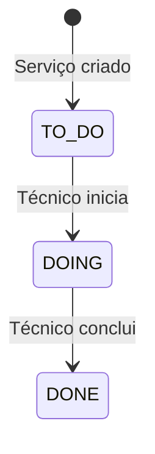

# Ciclo de Vida da Ordem de Serviço

## Estados da OS



## Descrição de Cada Estado

| Estado | Descrição | Quem age |
|---|---|---|
| `RECEBIDA` | OS criada com lista de serviços solicitados | Sistema / Atendente |
| `EM_DIAGNOSTICO` | Técnico avalia o veículo e reserva peças/insumos | Técnico |
| `AGUARDANDO_APROVACAO` | Orçamento calculado automaticamente; aguarda aprovação do cliente | Cliente |
| `APROVADO` | Cliente aprovou o orçamento; execução dos serviços começa | Cliente |
| `FINALIZADA` | Todos os serviços estão com status `DONE`; reservas confirmadas | Técnico |
| `ENTREGUE` | Veículo entregue ao cliente; OS encerrada | Atendente |

## Status dos Serviços Internos

Cada serviço dentro da OS tem seu próprio ciclo:



> [!warning] Regra de Finalização
> A OS só pode transitar para `FINALIZADA` quando **todos** os serviços internos estiverem com status `DONE`.

## Fluxo Completo — Exemplo Prático

```mermaid
sequenceDiagram
    actor Cliente
    actor Atendente
    actor Técnico

    Atendente->>API: POST /order (RECEBIDA)
    Técnico->>API: PATCH /order/{id} → EM_DIAGNOSTICO
    Técnico->>API: POST /api/stocks/reservations (reserva peças)
    Note over API: Budget gerado automaticamente
    Técnico->>API: PATCH /order/{id} → AGUARDANDO_APROVACAO
    Cliente->>API: GET /api/clients/my-orders/{id} (vê orçamento)
    Cliente->>API: PATCH /api/clients/my-orders/{id}/approve
    Note over API: Status → APROVADO
    Técnico->>API: PATCH /services/update-status (TO_DO → DOING → DONE)
    Técnico->>API: PATCH /order/{id} → FINALIZADA
    Note over API: Reservas confirmadas; estoque debitado
    Atendente->>API: PATCH /order/{id} → ENTREGUE
```

## Regras de Transição

> [!danger] Transições Inválidas
> O sistema bloqueia transições que não seguem o fluxo definido. Tentar avançar um estado fora de sequência retorna erro de validação.

> [!info] Rejeição pelo Cliente
> Se o cliente rejeitar o orçamento, a OS pode retornar a `RECEBIDA` para novo diagnóstico. As reservas de estoque são **liberadas** automaticamente (`RELEASED`).

## Links Relacionados
- [[Reserva de Estoque]]
- [[Orcamento]]
- [[API - Ordens de Servico]]
- [[API - Servicos]]
- [[API - Clientes]]
