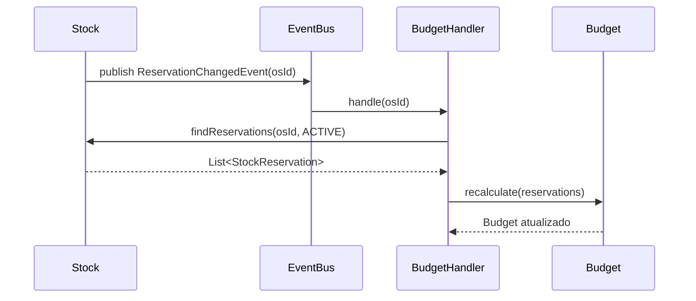

# Geração de Orçamento

## Conceito

O orçamento é **gerado automaticamente** a partir das reservas de estoque ativas para uma OS. Não há endpoint para criar orçamento manualmente — ele é acionado por eventos.

> [!info] Event-Driven
> O orçamento é um reflexo das reservas. Sempre que uma reserva é criada, confirmada ou liberada, o orçamento é recalculado automaticamente via `ReservationChangedEvent`.

## Fórmula de Cálculo

$$
\text{Total da OS} = \sum_{i=1}^{n} (\text{quantidade}_i \times \text{preçoUnitário}_i)
$$

Onde cada $i$ é um item de reserva ativa (`ACTIVE`) vinculado à OS.

## Snapshot de Preço

> [!warning] Preço Congelado no Momento da Aprovação
> Quando o orçamento é aprovado pelo cliente, os preços são **capturados (snapshot)** naquele momento. Alterações futuras nos preços dos produtos não afetam o orçamento já aprovado.

## Domínio

### Budget
```
Budget
├── id (UUID)
├── serviceOrderId (UUID)       ← OS vinculada
├── totalAmount (BigDecimal)    ← total calculado
├── status (PENDING/APPROVED)
└── items: List<BudgetItem>
```

### BudgetItem
```
BudgetItem
├── id (UUID)
├── budgetId (UUID)
├── productName (String)        ← nome snapshot
├── unitPrice (BigDecimal)      ← preço snapshot
├── quantity (Integer)
└── subtotal (BigDecimal)       ← unitPrice × quantity
```

## Fluxo de Geração



## Consulta do Orçamento

O orçamento é retornado junto com a OS nas rotas de listagem e detalhe:

- `GET /order/{id}` → inclui orçamento no response
- `GET /order` → inclui orçamento em cada OS listada
- `GET /api/budgets/service-order/{serviceOrderId}` → consulta direta
- `GET /api/clients/my-orders/{orderId}` → portal do cliente (vê orçamento antes de aprovar)

## Links Relacionados
- [[Reserva de Estoque]]
- [[Ciclo de Vida da OS]]
- [[API - Orcamento]]
- [[Padroes de Projeto]]
