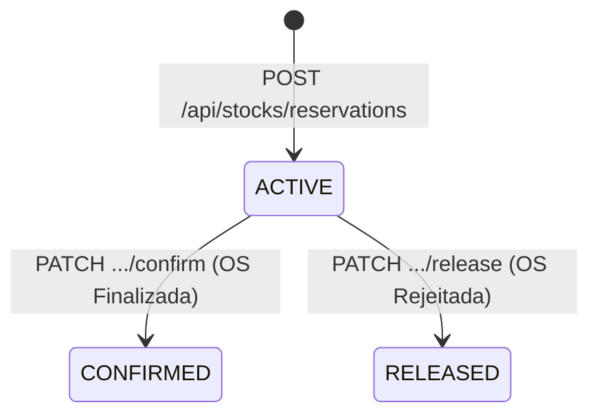

# Reserva de Estoque

## Conceito

A reserva de estoque é uma **operação atômica** — múltiplos produtos são reservados em uma única transação. Se qualquer reserva falhar (estoque insuficiente), **todas** são revertidas.

> [!danger] Tudo ou Nada
> Nunca haverá uma reserva parcial. Ou todos os produtos são reservados com sucesso, ou nenhum é.

## Fórmula do Estoque Disponível

$$
\text{disponível} = \text{quantidade} - \text{quantidade\_reservada}
$$

A operação de reserva só prossegue se `disponível >= quantidade_solicitada`.

## Estados de uma Reserva



| Status | Significado |
|---|---|
| `ACTIVE` | Estoque reservado; ainda não consumido |
| `CONFIRMED` | Estoque efetivamente consumido (OS finalizada) |
| `RELEASED` | Reserva cancelada; estoque liberado (OS rejeitada ou cancelada) |

## Rastreabilidade de Movimentações

Toda alteração no estoque gera um registro em `StockMovement`:

| Tipo de Movimento | Trigger |
|---|---|
| `ENTRY` | Entrada de estoque (`PATCH /entry`) |
| `EXIT` | Saída manual de estoque (`PATCH /exit`) |
| `RESERVATION` | Reserva criada para OS |
| `RESERVATION_CONFIRMED` | Reserva confirmada (consumo real) |
| `RESERVATION_RELEASED` | Reserva liberada (sem consumo) |

## Alerta de Estoque Mínimo

O campo `minimumQuantity` define o limiar de alerta. O endpoint `/api/stocks/low` lista todos os produtos abaixo do mínimo:

$$
\text{isLowStock} = \text{availableQuantity} \leq \text{minimumQuantity}
$$

## Operações de Domínio do Stock

```java
stock.addQuantity(amount)          // entrada de estoque
stock.removeQuantity(amount)       // saída manual (valida negatividade)
stock.reserve(amount, osId)        // reserva atômica (valida disponibilidade)
stock.releaseReservation(osId)     // libera reserva
stock.confirmReservation(osId)     // confirma consumo
stock.isLowStock()                 // verifica limiar mínimo
```

## Relacionamento com Orçamento

Ao criar ou alterar uma reserva, o sistema publica um `ReservationChangedEvent`. O módulo de orçamento **reage automaticamente** e recalcula o total da OS.

```
Reserva criada → evento → Orçamento recalculado
```

## Links Relacionados
- [[Ciclo de Vida da OS]]
- [[Orcamento]]
- [[API - Estoque]]
- [[Padroes de Projeto]]
