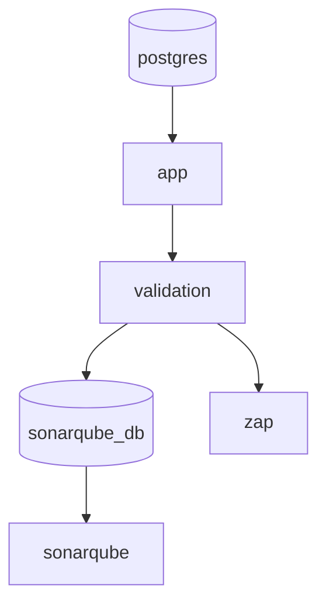

# Docker Compose — Serviços e Orquestração

## Serviços Definidos



| Serviço | Imagem | Porta | Finalidade |
|---|---|---|---|
| `postgres` | postgres:16 | 5432 | Banco de dados principal |
| `app` | build local | 8080 | Spring Boot API |
| `validation` | curl/bash | — | Testes funcionais end-to-end |
| `sonarqube_db` | postgres:16 | — | Banco exclusivo do SonarQube |
| `sonarqube` | sonarqube:community | 9000 | Análise estática de código |
| `zap` | zaproxy/zap-stable | — | Scan de segurança DAST |

> [!info] App Comentado por Padrão
> O serviço `app` está comentado no `docker-compose.yml`. A aplicação é rodada localmente via `./mvnw spring-boot:run` para agilizar o ciclo de desenvolvimento (sem rebuild de imagem Docker a cada alteração).

---

## Ordem de Inicialização

```
1. postgres         → sobe o banco
2. app              → aguarda postgres estar saudável
3. validation       → aguarda app responder
4. sonarqube_db     → aguarda validation completar com sucesso
5. sonarqube        → aguarda sonarqube_db
6. zap              → aguarda validation completar com sucesso
```

A condição `condition: service_completed_successfully` garante que o SonarQube e ZAP só rodam se a validação funcional passar.

---

## Comandos Essenciais

```bash
# Subir tudo em background
docker compose up -d

# Subir apenas o banco (desenvolvimento local)
docker compose up -d postgres

# Ver logs de um serviço
docker compose logs -f postgres
docker compose logs -f app

# Parar tudo
docker compose down

# Parar e remover volumes (reset completo)
docker compose down -v

# Rebuild da imagem do app
docker compose build app

# Verificar status dos serviços
docker compose ps
```

---

## PostgreSQL (Banco Principal)

```yaml
postgres:
  image: postgres:16
  environment:
    POSTGRES_DB: workshop
    POSTGRES_USER: user
    POSTGRES_PASSWORD: password
  ports:
    - "5432:5432"
  volumes:
    - ./init.sh:/docker-entrypoint-initdb.d/init.sh
```

O script `init.sh` é executado **automaticamente** na primeira vez que o container sobe. Ele:
1. Cria o schema do banco (todas as tabelas)
2. Insere dados de teste (3 clientes, veículos, peças, estoque inicial)

> [!warning] Idempotência
> O `init.sh` usa `INSERT ... ON CONFLICT DO NOTHING`. Pode ser re-executado sem duplicar dados.

---

## SonarQube

Acessível em `http://localhost:9000` após subir.

**Credenciais padrão:** `admin` / `admin` (altere no primeiro acesso)

Para rodar a análise:
```bash
./mvnw sonar:sonar
```

---

## OWASP ZAP

O ZAP roda como serviço no Docker Compose após a validação. Os relatórios são salvos em:
```
./zap-reports/
├── zap-report.html   ← relatório visual
├── zap-report.json   ← dados para CI/CD
└── zap-scan.log      ← log de execução
```

---

## Dockerfile (Multi-Stage Build)

```dockerfile
# Stage 1: Build
FROM maven:3.9-eclipse-temurin-21 AS builder
WORKDIR /app
COPY pom.xml .
RUN mvn dependency:go-offline    # cache de dependências
COPY src ./src
RUN mvn clean package -DskipTests

# Stage 2: Runtime
FROM eclipse-temurin:21-jre-alpine
WORKDIR /app
COPY --from=builder /app/target/*.jar app.jar
ENTRYPOINT ["java", "-jar", "app.jar"]
```

---

## Links Relacionados
- [[Quickstart]]
- [[SonarQube]]
- [[OWASP ZAP]]
- [[Configuracao Docker]]
