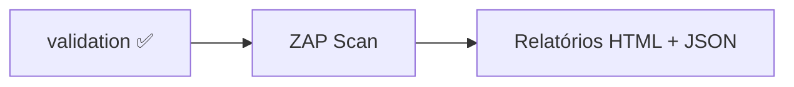

# OWASP ZAP — Scan de Segurança

## O que é o OWASP ZAP?

**OWASP ZAP** (Zed Attack Proxy) é uma ferramenta de **DAST** (Dynamic Application Security Testing) — testa a segurança da aplicação **enquela está em execução**, simulando ataques reais contra a API.

> [!info] DAST vs SAST
> - **SAST** (SonarQube): analisa o código-fonte sem executar
> - **DAST** (ZAP): executa a aplicação e testa os endpoints com payloads maliciosos

---

## Como está Integrado

O ZAP roda como **serviço Docker** após a validação funcional ser bem-sucedida:



```yaml
# docker-compose.yml
zap:
  image: zaproxy/zap-stable
  volumes:
    - ./zap:/zap/wrk
    - ./zap-reports:/zap/reports
  command: /zap/wrk/zap-scan.sh
  depends_on:
    validation:
      condition: service_completed_successfully
```

---

## Script do Scan (`zap/zap-scan.sh`)

O script realiza:

```bash
# 1. Aguarda a app estar disponível (HTTP health check)
until curl -s -o /dev/null -w "%{http_code}" "$APP_URL/swagger-ui/index.html" | grep -qE "^[2-5]"; do
  sleep 2
done

# 2. Autentica e obtém o JWT
TOKEN=$(curl -s -X POST "$APP_URL/auth/login" \
  -H "Content-Type: application/json" \
  -d "{\"email\":\"$ZAP_AUTH_EMAIL\",\"password\":\"$ZAP_AUTH_PASSWORD\"}" \
  | jq -r '.token')

# 3. Executa o scan autenticado contra a spec OpenAPI
zap-api-scan.py \
  -t "$APP_URL/v3/api-docs" \
  -f openapi \
  -r /zap/reports/zap-report.html \
  -J /zap/reports/zap-report.json \
  -c /zap/wrk/rules.conf \
  -I \
  --hook=/zap/wrk/add_auth_header.py  # injeta Bearer token em todas as requisições
```

---

## Variáveis de Ambiente do ZAP

| Variável | Valor Default | Descrição |
|---|---|---|
| `APP_URL` | `http://app:8080` | URL da aplicação (nome do serviço Docker) |
| `ZAP_AUTH_EMAIL` | `superadmin@system.com` | Email para autenticação |
| `ZAP_AUTH_PASSWORD` | `coxinha123` | Senha para autenticação |

---

## Relatórios Gerados

Após o scan, os relatórios são salvos em `./zap-reports/`:

| Arquivo | Formato | Uso |
|---|---|---|
| `zap-report.html` | HTML visual | Revisão manual pelos desenvolvedores |
| `zap-report.json` | JSON | Integração com CI/CD, tracking de vulnerabilidades |
| `zap-scan.log` | Log de texto | Debug do processo de scan |

---

## `rules.conf` — Configuração de Regras

O arquivo `zap/rules.conf` define quais alertas são PASS, WARN ou FAIL:

```
# Formato: ID_REGRA	NIVEL
10010	IGNORE   # Cookie Without Secure Flag (dev environment)
10011	WARN     # Cookie Without HttpOnly Flag
10015	FAIL     # Incomplete or No Cache-control Header Set
10096	WARN     # Timestamp Disclosure
```

**Níveis:**
| Nível | Significado | Exit Code |
|---|---|---|
| `IGNORE` | Ignorado completamente | 0 |
| `INFO` | Apenas informativo | 0 |
| `WARN` | Alerta registrado | 1 |
| `FAIL` | Falha crítica | 2 |

---

## Flag `-I` (Info Mode)

O script usa a flag `-I` (informational):

```bash
zap-api-scan.py -I ...
```

> [!info] Modo Informacional
> `-I` faz o script **sempre retornar exit code 0**, independente das vulnerabilidades encontradas. Isso evita que o scan interrompa o pipeline enquanto o projeto ainda está em desenvolvimento.
>
> Para CI/CD em produção, remova `-I` para que vulnerabilidades críticas (FAIL) bloqueiem o deploy.

---

## Categorias de Vulnerabilidades Testadas

O ZAP testa automaticamente contra as vulnerabilidades do OWASP Top 10:

| Categoria | Exemplos de Teste |
|---|---|
| **Injection** | SQL Injection, Command Injection nos parâmetros |
| **Broken Auth** | Tokens fracos, sessões não expiradas |
| **Sensitive Data Exposure** | Dados sensíveis em respostas |
| **XXE** | XML External Entity nos payloads |
| **Security Misconfiguration** | Headers de segurança ausentes |
| **XSS** | Cross-Site Scripting em campos de entrada |
| **Insecure Deserialization** | Payloads maliciosos em JSON |
| **Known Vulnerabilities** | Dependências com CVEs conhecidos |

---

## Rodar o Scan Manualmente

```bash
# Via Docker Compose (requer validação prévia)
docker compose up zap

# Diretamente (aplicação já rodando)
docker run -v $(pwd)/zap:/zap/wrk -v $(pwd)/zap-reports:/zap/reports \
  zaproxy/zap-stable /zap/wrk/zap-scan.sh
```

---

## Interpretando o Relatório HTML

O relatório HTML categoriza alertas por risco:

- 🔴 **High** — Vulnerabilidade crítica, corrigir imediatamente
- 🟠 **Medium** — Vulnerabilidade significativa, corrigir em breve
- 🟡 **Low** — Vulnerabilidade menor, corrigir quando possível
- 🔵 **Informational** — Observação de segurança

---

## Links Relacionados
- [[Spring Security Config]]
- [[JWT]]
- [[Docker Compose]]
- [[SonarQube]]
