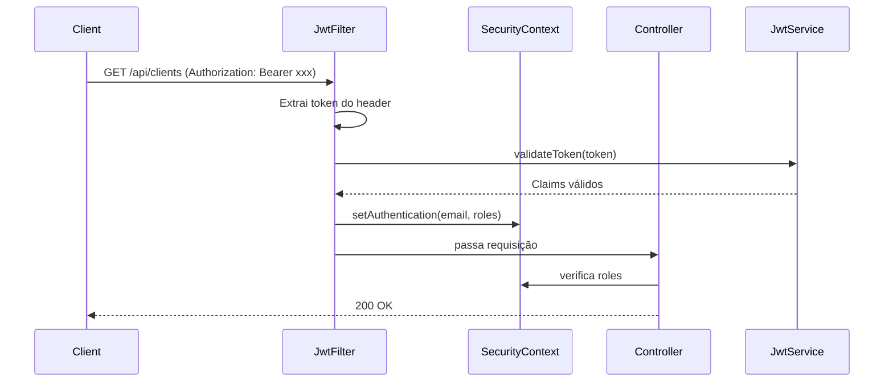

# Spring Security — Configuração

## Filter Chain

A classe `SecurityConfig.java` define a cadeia de filtros do Spring Security:

```java
@Bean
public SecurityFilterChain securityFilterChain(HttpSecurity http) throws Exception {
    return http
        // 1. CSRF desabilitado (API stateless com JWT)
        .csrf(csrf -> csrf.disable())

        // 2. Sessão stateless (sem HttpSession)
        .sessionManagement(session ->
            session.sessionCreationPolicy(SessionCreationPolicy.STATELESS))

        // 3. Regras de autorização por endpoint
        .authorizeHttpRequests(auth -> auth
            // Públicos
            .requestMatchers("/auth/**").permitAll()
            .requestMatchers("/swagger-ui.html", "/swagger-ui/**").permitAll()
            .requestMatchers("/v3/api-docs/**").permitAll()

            // Portal do cliente
            .requestMatchers("/api/clients/my-orders/**")
                .hasAnyRole("USER", "ADMIN", "TECHNICIAN")

            // Restante: admin ou técnico
            .anyRequest().hasAnyRole("ADMIN", "TECHNICIAN")
        )

        // 4. Filtro JWT executado antes do UsernamePasswordAuthenticationFilter
        .addFilterBefore(jwtFilter, UsernamePasswordAuthenticationFilter.class)

        .build();
}
```

---

## Fluxo de uma Requisição Autenticada



---

## `CustomUserDetailsService`

Implementa `UserDetailsService` para carregar usuário do banco por email:

```java
@Service
public class CustomUserDetailsService implements UserDetailsService {

    @Override
    public UserDetails loadUserByUsername(String email) throws UsernameNotFoundException {
        return userRepository.findByEmail(email)
            .map(user -> new org.springframework.security.core.userdetails.User(
                user.getEmail(),
                user.getPassword(),
                user.getRoles().stream()
                    .map(role -> new SimpleGrantedAuthority(role.getName()))
                    .toList()
            ))
            .orElseThrow(() -> new UsernameNotFoundException("User not found: " + email));
    }
}
```

---

## Password Encoding

Senhas são armazenadas com **BCrypt** (fator de custo 10):

```java
@Bean
public PasswordEncoder passwordEncoder() {
    return new BCryptPasswordEncoder();
}
```

> [!info] BCrypt
> BCrypt inclui salt automático e é projetado para ser lento, dificultando ataques de força bruta. O hash armazenado no banco nunca é igual mesmo para a mesma senha.

---

## Headers de Segurança (Spring Security Defaults)

O Spring Security adiciona automaticamente:

| Header | Valor | Proteção |
|---|---|---|
| `X-Content-Type-Options` | `nosniff` | Evita MIME sniffing |
| `X-Frame-Options` | `DENY` | Evita clickjacking |
| `Cache-Control` | `no-cache, no-store` | Evita cache de respostas sensíveis |
| `X-XSS-Protection` | `0` | Desabilita XSS auditor (deprecated) |

---

## Sobre CSRF Desabilitado

> [!warning] Por que CSRF está desabilitado?
> CSRF é uma vulnerabilidade que afeta aplicações que usam **cookies** para autenticação (onde o browser envia cookies automaticamente em requisições cross-site).
>
> Esta API usa **JWT no header `Authorization`** — o browser não envia headers customizados automaticamente em requisições cross-site. Portanto, CSRF não é aplicável e desabilitá-lo é correto.

---

## Links Relacionados
- [[JWT]]
- [[Autorizacao e Roles]]
- [[OWASP ZAP]]
- [[API - Autenticacao]]
